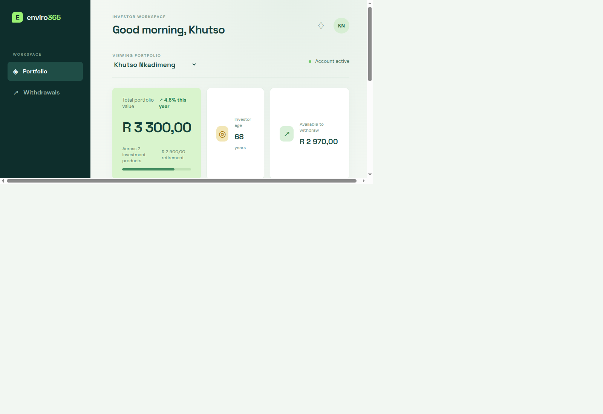
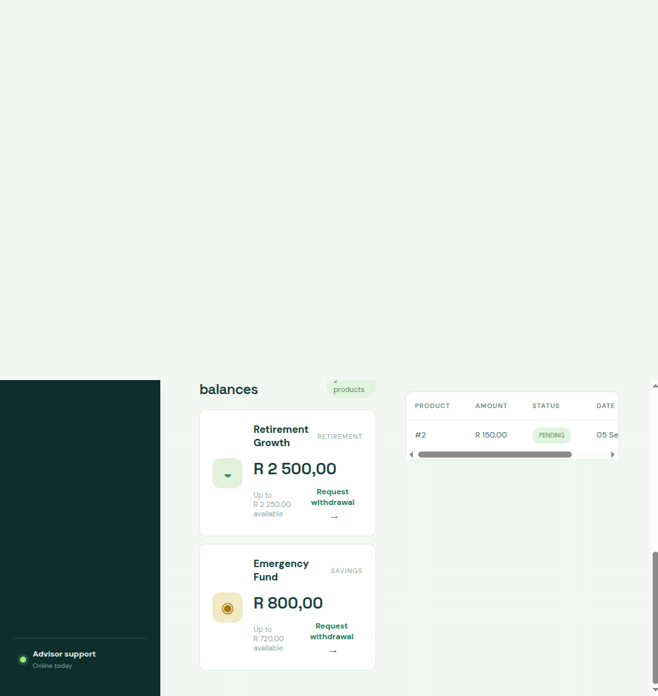
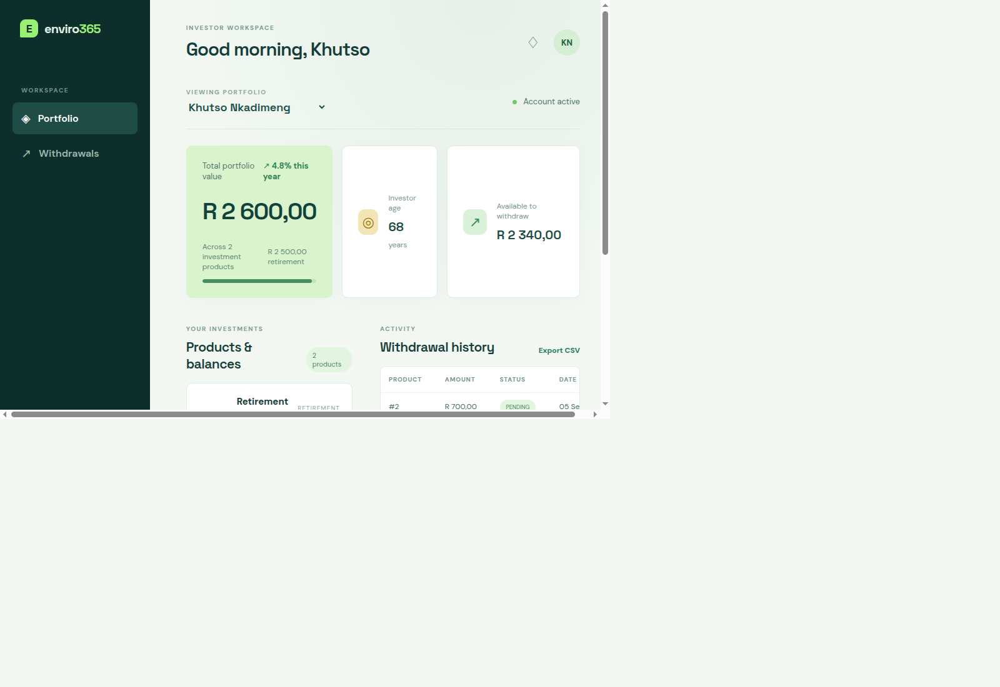
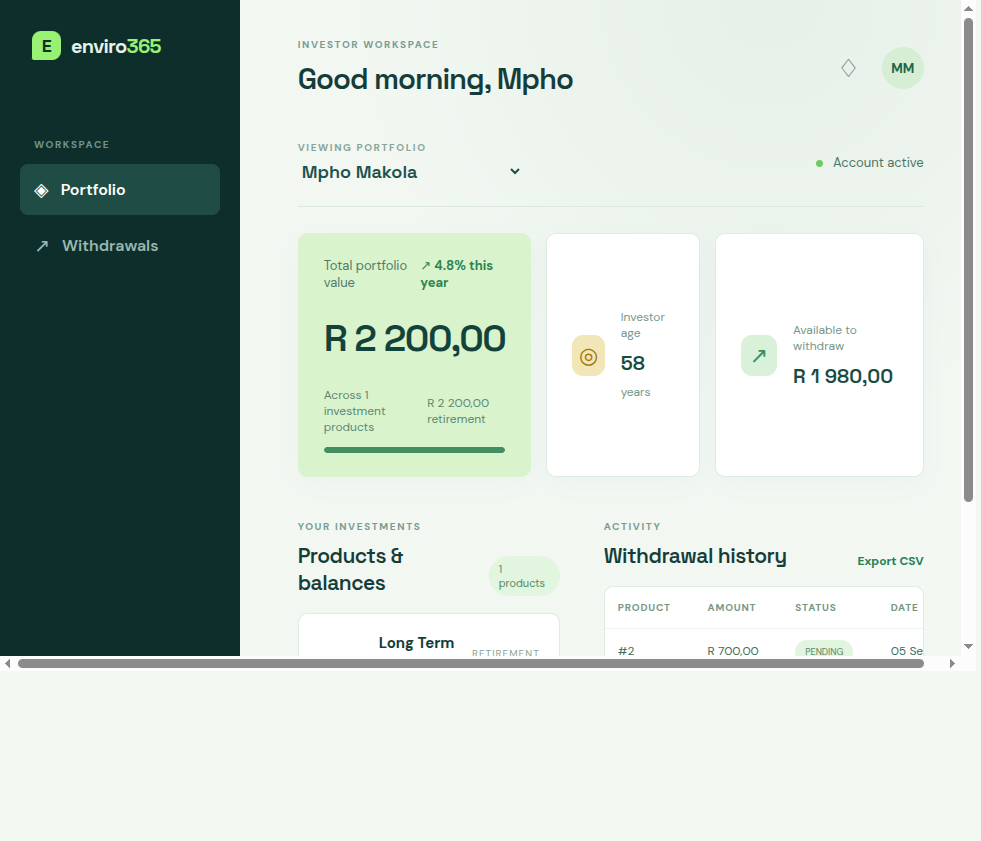

# Enviro365 Investments Portal

Enviro365 is a full-stack withdrawal notice application for an investment provider. It gives an investor a portfolio view, shows product balances, validates withdrawal requests, records notices, and exports withdrawal history as CSV.

## Technology

- **Backend:** Java 21, Spring Boot 4.1.1, Spring Web MVC, Spring Data JPA, H2
- **Frontend:** React, TypeScript, Vite
- **Persistence:** H2 in-memory database, initialized from `backend/src/main/resources/data.sql`
- **API:** REST under `/api/v1`

## Repository Layout

```text
backend/
   pom.xml                         Maven build and dependencies
   src/main/java/.../
      controller/                   HTTP endpoints
      dto/                          API request and response records
      model/                        JPA database entities
      repository/                   Spring Data database access
      service/                      Portfolio and withdrawal rules
   src/main/resources/
      application.properties        Server and database configuration
      data.sql                      Development seed data
   src/test/java/.../              Backend tests
frontend/
   package.json                    npm scripts and dependencies
   src/App.tsx                     Dashboard and withdrawal workflow
   src/styles.css                  Responsive application styling
   vite.config.ts                  Dev server and backend API proxy
```

The backend follows this request path:

```text
React frontend -> Controller -> PortfolioService -> Repository -> JPA model -> H2
```

DTOs keep the public API shape separate from the database entities.

## Prerequisites

- Java 21
- Maven 3.9 or newer
- Node.js 18 or newer and npm

## Run Locally

Start the backend first in one terminal from the repository root:

```bash
mvn -f backend/pom.xml spring-boot:run
```

The backend runs at `http://localhost:8080`. The Maven wrapper scripts are present, but the wrapper metadata is not currently included, so the system Maven command above is the supported command.

Start the frontend in a second terminal:

```bash
cd frontend
npm install
npm run dev
```

Open `http://localhost:5173`. Vite proxies `/api` requests to the backend at port 8080.

## Screenshots

### Portfolio dashboard



### Withdrawal form



### Successful withdrawal and balance update



### Retirement withdrawal rule context



## Verification Commands

Run backend tests:

```bash
mvn -f backend/pom.xml test
```

Build the frontend:

```bash
cd frontend
npm run build
```

## API Reference

### Get a portfolio

```http
GET /api/v1/investors/{investorId}/portfolio
```

Example response:

```json
{
   "id": 1,
   "firstName": "Khutso",
   "lastName": "Nkadimeng",
   "age": 68,
   "products": [
      {
         "id": 1,
         "type": "RETIREMENT",
         "name": "Retirement Growth",
         "currentBalance": 2500.0
      }
   ]
}
```

### Create a withdrawal notice

```http
POST /api/v1/withdrawals
Content-Type: application/json
```

Request body:

```json
{
   "productId": 1,
   "withdrawalAmount": 500.0,
   "bankingDetails": "FNB account ending 6789"
}
```

The service enforces these rules:

- Retirement withdrawals require an investor older than 65.
- The amount must be positive.
- The amount cannot exceed the current product balance.
- The amount cannot exceed 90% of the current product balance.
- A valid notice is saved with `PENDING` status and the product balance is reduced.

### List withdrawal notices

```http
GET /api/v1/withdrawals
```

### Export withdrawal history

```http
GET /api/v1/withdrawals/export
GET /api/v1/withdrawals/export?productId=1&status=PENDING
```

The response is CSV text.

## Seed Users

Development data includes these investors:

| ID | Investor | Email | Age |
|---:|---|---|---:|
| 1 | Khutso Nkadimeng | khutso@email.com | 68 |
| 2 | David Lesaomako | david@email.com | 72 |
| 3 | Relebohile Mofokeng | relebohile@email.com | 61 |
| 4 | Mpho Makola | mpho@email.com | 58 |

Because H2 runs in memory, data resets when the backend restarts. The H2 console is available at `http://localhost:8080/h2-console` using JDBC URL `jdbc:h2:mem:envirodb`, username `sa`, and password `password`.

## Important Development Notes

- Start the backend before using the frontend; otherwise dashboard requests will fail.
- The current database is for development and demonstration only. It is not durable across restarts.
- Business and input validation errors are returned through a centralized exception handler with consistent HTTP 400 responses.
- Banking details are stored as plain text in the demo database. Production code should encrypt or tokenize sensitive banking information.

## AI Use

See [docs/AI-USAGE.md](docs/AI-USAGE.md) for the project record of how AI assistance was used and how generated changes were validated.

